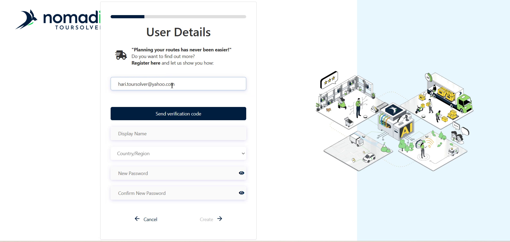
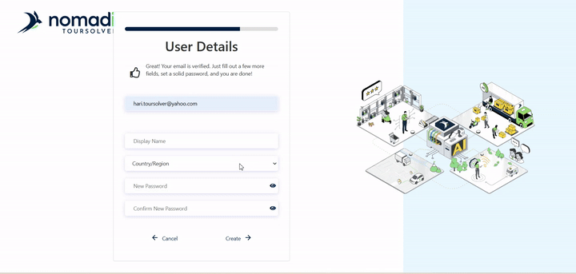

# Signup process-Creating an Account

# Comprehensive User Guide: Creating an Account for TourSolver (TwoSolver Test Environment)

## 1. Friendly Introduction

Welcome! We are excited that you are choosing **TwoSolver** [6:13]. This guide will walk you through creating your new account in the TwoSolver platform test environment. The process is quick and simple, designed to get you started immediately.

By following these steps, you will quickly have a functioning **TwoSolver Trail account** [4:03].

## 2. Getting Started Section

This section covers the essential steps for setting up your access and configuring your initial company details.

### System Requirements and Installation

The sources provided focus exclusively on the steps within the TwoSolver platform test environment. They do not specify external system requirements (like operating system or browser versions) or external installation steps needed before accessing the platform.

### Initial Configuration: Setting Up Company Details (Onboarding)

After setting your profile details and logging in, you will be taken to the Onboarding page. This is where you finalize the initial configuration of your account.

#### Steps for Onboarding

1.  **Enter Company Details:** Enter essential information like your company name and address.

## 3. Feature Explanations with Benefits

When you complete the sign-up process, your **TwoSolver Trail account is ready** [1, 4:03].

The benefit of the trial account is immediate access to the platform for testing and evaluation.

⚠️ **Trail Account Limitations**
Please note that the Trail account comes with specific limitations [1, 4:03]. For example, you are restricted to **up to 250 visits per optimization**. To unlock full access and remove these constraints, you will need to **switch to the production version**.

## 4. Common Tasks with Detailed Steps

The most common task is **Creating a New Account** (The Sign-up Process).

### Task 1: Creating Your New TwoSolver Account

Follow these steps to successfully create and verify your profile in the TwoSolver platform test environment.

#### A. Email Verification (Sign up)

1.  **Start Sign Up:** Click on **Sign up now** to begin creating your new account.

4.  **Check Email:** You will receive a One-Time Password (OTP) via email.

    *   *Outcome:* Once verified, you will see a confirmation message stating, **"your email has been verified"** [1, 1:03–1:08].

#### B. Setting Profile Details

2.  **Enter Password:** Enter your desired password.
    *   ⚠️ **Password Requirement Warning:** Ensure your password includes specific security elements: **at least one uppercase letter, one lowercase letter, a number, and a special character** [1, 1:08–1:33].

#### C. Accept Terms and Login

1.  **Review EULA:** Before proceeding, make sure you check the **End User License Agreement** [1, 3:19–3:25].

Your account is now ready.

### Task 2: Checking Your Credentials

To ensure that your newly created account credentials are working correctly, you should perform a test login.

*   **Log out** and then **login back again** [1, 4:27–4:43].

### Task 3: Handling Existing Accounts

If you attempt to sign up using an email address that is already registered in the system, the platform will notify you.

*   **Existing User Message:** If the email address is already used, you will receive a message stating: **"a user with the specified ID already exist. Please choose the different one"** [1, 6:03–6:13].

## 5. Productivity Tips

💡 **Unlocking Full Potential**
Remember that your initial account is a **Trail account** with limitations (e.g., 250 visits per optimization). If you plan to use TwoSolver for production, you must **switch to the production version** to unlock full access.

💡 **OTP Code Management**
If you are dealing with an existing account or repeating the sign-up process, ensure you use the correct verification code. You must click the **Send Verification Code** button, copy the code, paste it in the verification field, and then click **Verify Code** [1, 5:01–5:39].