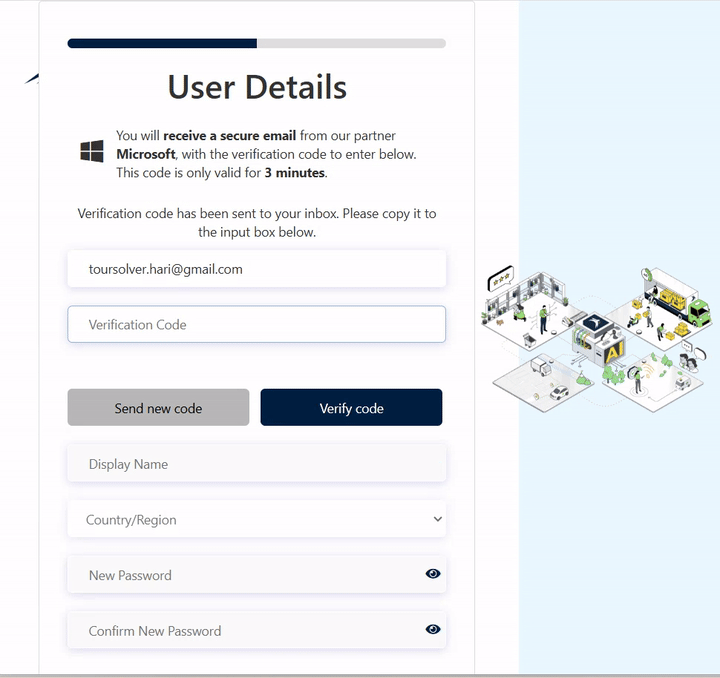
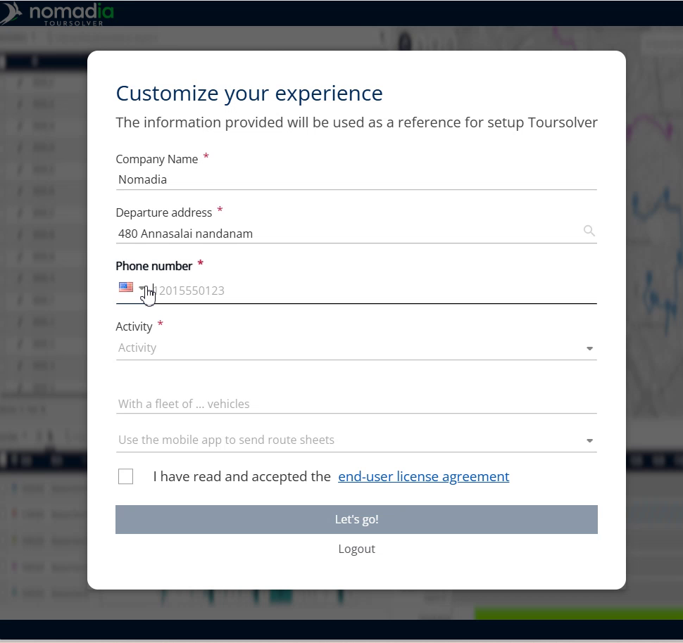
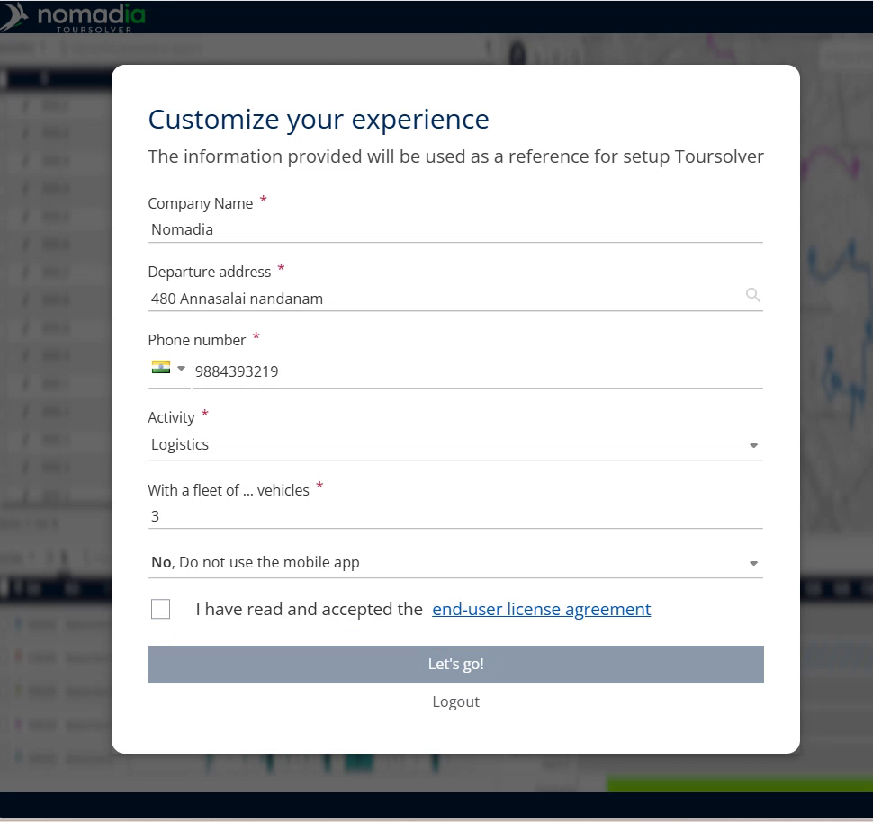

# Creating an account

## 🧭 TourSolver User Guide: Creating Your Account

Welcome! We are excited to help you get started with the TourSolver platform. This guide will walk you through creating your account in the **TourSolver Test Environment**. By following these simple, step-by-step instructions, you will successfully set up your trial account and begin exploring the features.

***

### 2. Getting Started: Setting Up Your Trial Account

Creating your account involves three main stages: email verification, setting up your profile, and providing initial company details.

#### Stage 1: Email Verification and Sign Up

This task ensures that your email address is correctly linked to your new TourSolver account.

1.  **Start the Sign-Up Process**
    Click on **sign up now** to begin creating your account.

2.  **Enter Your Email**
    Enter your email address into the required field and click **send verification code**.

3.  **Verify the Code**
    You will receive a One-Time Password (OTP) via email.
    *   Copy the OTP you received.
    *   Paste the OTP into the **OTP verification** field.
    *   Click **verify code**.

    **Expected Outcome:** Once verified, you will see a confirmation message stating, "your email has been verified".

> **Visual Guidance 1: Email Verification (Diagram)**
> A diagram here would show the fields for entering the email, the **send verification code** button, and the subsequent field for pasting the OTP.

***

#### Stage 2: Setting Your Profile Details

In this stage, you will define your basic login information, including your name, country, and secure password.

1.  **Input Personal Details**
    Fill in your personal details, including your **Name** and **Country**.

 – Profile information is being collected.")

2.  **Create a Secure Password**
    Enter your chosen password.

    ⚠️ **Warning: Password Requirements**
    You must ensure your password includes the following four elements:
    *   At least one **uppercase letter**.
    *   At least one **lowercase letter**.
    *   A **number**.
    *   A **special character**.

    ⚠️ **Warning: Password Match**
    If you enter a password incorrectly, you will receive a message saying "the password do not match". If this happens, please re-enter the correct, matching password.

3.  **Finalize Profile Creation**
    Click **create** (or **create to continue**).

> **Visual Guidance 2: Password Requirements (Screenshot)**
> This visual would highlight the specific password fields and the list of requirements (uppercase, lowercase, number, special character) clearly displayed beneath the input box.

***

### 3. Feature Explanations and Context

You are creating a **TourSolver Trial Account**. This trial environment is fully functional but comes with specific limitations.

*   **Benefit:** The Trial Account allows you to test the platform quickly without immediate commitment.
*   **Limitation:** Trial Accounts are limited to **up to 250 visits per optimization**.

***

### 4. Common Tasks: Initial Company Configuration (Onboarding)

After your profile is complete, you must provide basic information about your company to tailor the environment to your needs.

1.  **Enter Company Information**
    Provide details such as your company’s **Name** and **Address**.

2.  **Specify Contact and Activity**
    *   Specify your **phone number**.
    *   Mention the specific **activity** of your company.

3.  **Define Vehicle Needs**
    Specify the **number of vehicles** you want to utilize in the system.

4.  **Accept the License Agreement**
    Before proceeding, you must review and accept the **End User License Agreement**.
    *   Check the box to **accept it and continue**.

5.  **Go Live**
    Click **let's go to continue** to finalize the setup.

    **Expected Outcome:** Your account will be automatically created.

> **Visual Guidance 3: Onboarding Screen (Screenshot)**
> This screenshot would show the main fields where you input company Name, Address, Phone Number, Activity, and the input for the Number of Vehicles.

#### Task: Confirming Setup and Login

To ensure everything is working correctly, you should log in immediately after setup.

1.  **Confirm Login**
    Finally, **login again with your credentials** (the email and password you just created) to confirm the setup is complete.

> **Visual Guidance 4: Final Login Screen (Diagram)**
> A diagram showing the login fields (Email and Password) used to confirm the new account setup.

***

### 5. Productivity Tips

💡 **Tip: Unlocking Full Access**
Your current account is in the Test Environment and has trial limitations (e.g., 250 visits per optimization). To unlock the full capabilities and gain complete access to the platform, you will need to **switch to the production version**.